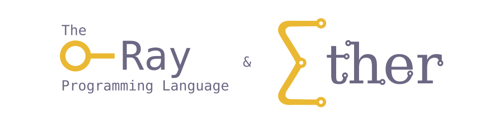
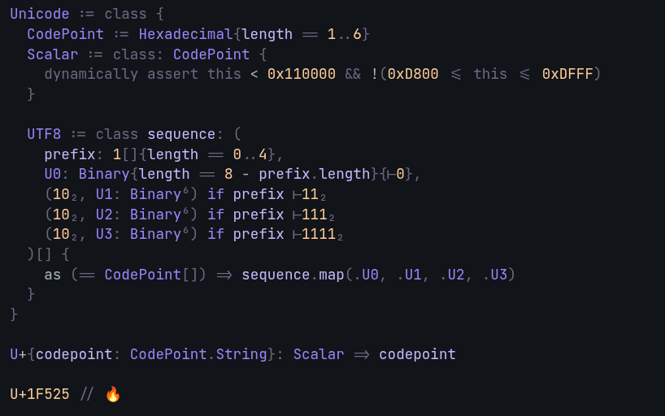

# Ether.ray - The Ray Programming Language & Ether

> [!NOTE]
> This is still a work in progress. Relevant progress is documented in this repo and [here](https://github.com/orbitmines/archive/blob/main/projects/Writing%20-%202025.%20A%20Universal%20Language.md)

---
<div align="center">



[](https://discord.orbitmines.com)

</div>

## What is this?

This thing is, in essence, a programming language (Ray) and an IDE (Ether), which together act as a theorem prover, version control system, database and rendering engine. Though to me, most importantly, it is here as infrastructure. Infrastructure for the design and implementation of a [different category of (programming) interfaces](https://orbitmines.com/archive/2024-02-orbitmines-as-a-game-project).

---

- If you prefer **text**, see [Ether's Almanac](https://orbitmines.com/almanac): *Your handbook for anything Ether, The Ray Programming Language & OrbitMines*, or more generally my/OrbitMines writing can be found [here](https://orbitmines.com).

- If you prefer **video**, see [<TODO; Make a stream to explain the project better](), or more generally my streams can be found here: [youtube.com/@FadiShawki/streams](https://www.youtube.com/@FadiShawki/streams).

- If you prefer **code**, see [/@ether](@ether), or more generally my/OrbitMines code can be found here [github.com/orbitmines](https://github.com/orbitmines/).

- If you prefer discussions on **Discord**: [discord.orbitmines.com](https://discord.orbitmines.com).

<div align="center">


</div>

## Local setup
*(untested on Mac/Windows)*

```shell
curl -fsSL https://ether.orbitmines.com/install.sh | bash
```

On Windows (PowerShell or cmd):

```shell
powershell -c "irm https://ether.orbitmines.com/install.ps1 | iex"
```

Or with npm ([Node.js](https://nodejs.org) 20.11 or later):

```shell
npm install -g @orbitmines/ether.ray
```

This installs `ether` (and `ray`, `orbitmines`) into `~/.ether/bin` and adds it to your PATH; `install.sh --uninstall` (or `install.ps1 -Uninstall`) removes it again.

- You can also install language support for [IntelliJ](https://plugins.jetbrains.com/plugin/29452-ether) / [VS Code](https://marketplace.visualstudio.com/items?itemName=orbitmines.ether-ray) (find it in their respective marketplaces under the name `Ether.ray`)


There are several alternative ways of installing Ray & Ether:
- Download the appropriate installer from [GitHub Releases](https://github.com/orbitmines/ray/releases)
- Open Ether in your browser @ [ether.orbitmines.com](https://ether.orbitmines.com)

- Or compile from source
  ```shell
  git clone git@github.com:orbitmines/ray.git
  ```

  ```shell
  cd ray && ./install.sh --compile
  ```
  
---

## Running Ether.ray

```shell
ether
```

---

## The Ray Programming Language ([Ether's Almanac](https://orbitmines.com/almanac/a-the-ray-programming-language))



[... continue reading](https://orbitmines.com/archive/towards-a-universal-language/)